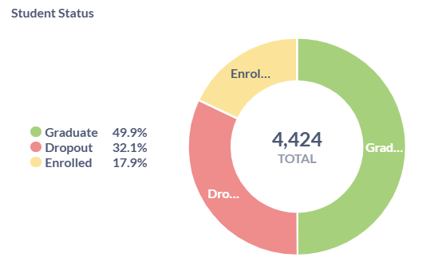
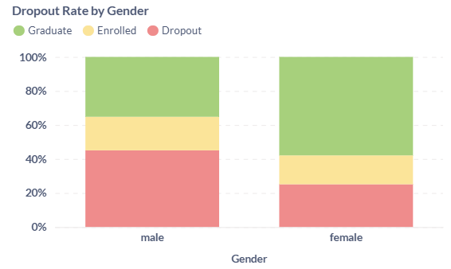
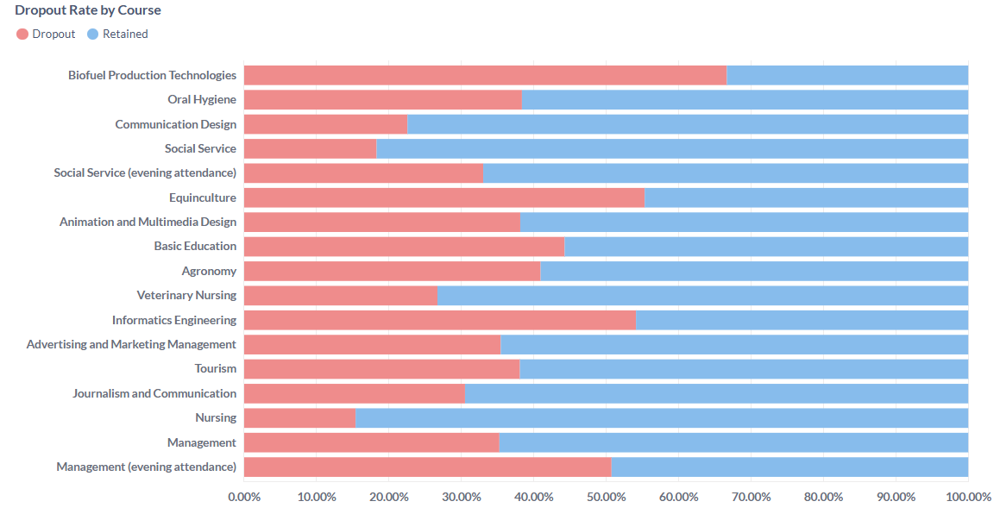
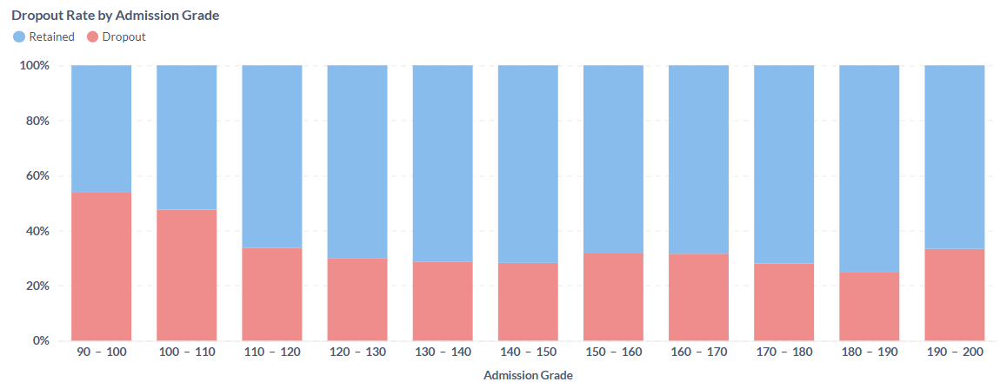
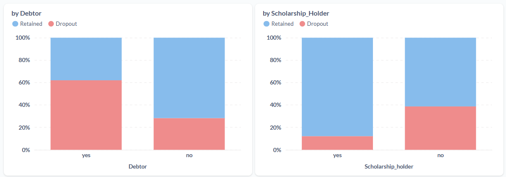
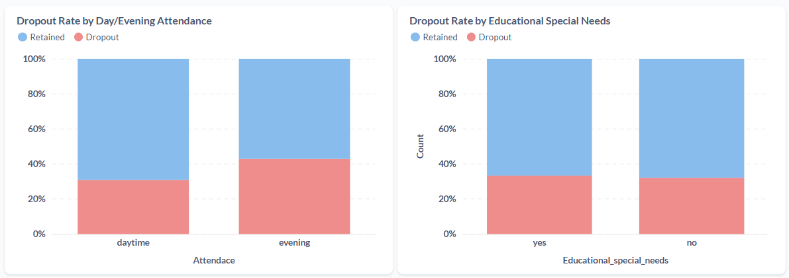
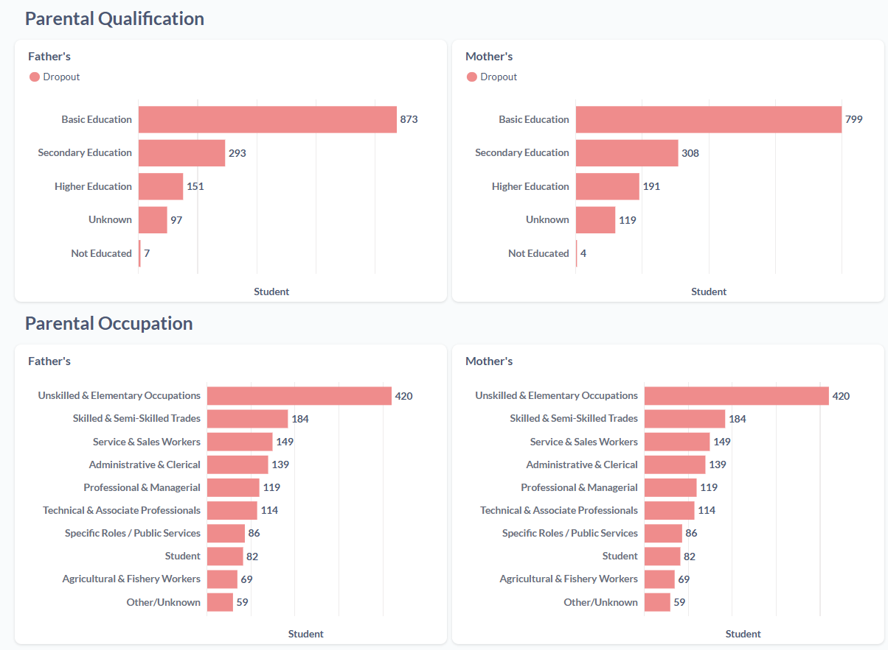
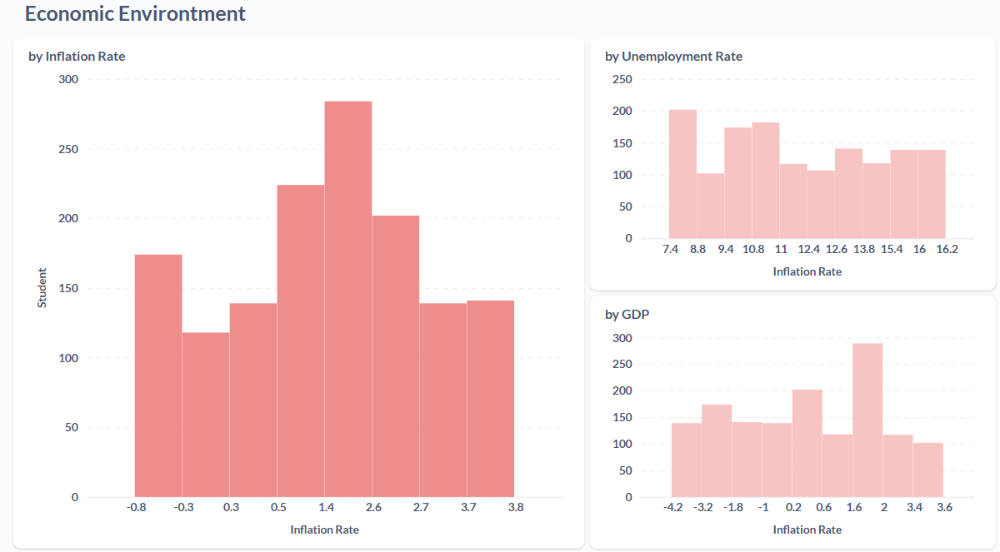

# Proyek Akhir: Menyelesaikan Permasalahan Perusahaan Edutech

## Business Understanding

Jaya Jaya Institut, sebuah institusi pendidikan tinggi terkemuka yang telah berdiri sejak tahun 2000, memiliki reputasi yang kokoh dalam mencetak lulusan-lulusan berkualitas. Institusi ini menawarkan beragam program studi baik untuk mahasiswa domestik maupun internasional. Namun, di balik citra keberhasilan dan sejarah panjangnya, Jaya Jaya Institut menghadapi tantangan serius yang terus meningkat: **tingginya tingkat dropout mahasiswa**. Ini bukan sekadar fenomena umum, tetapi sebuah permasalahan yang secara signifikan memengaruhi keberlanjutan dan efektivitas operasional institusi. Angka dropout yang substansial ini berarti bahwa sebagian besar mahasiswa yang mendaftar, pada akhirnya, tidak menyelesaikan program studi mereka hingga lulus.

### Permasalahan Bisnis

Tingkat dropout yang tinggi ini menjadi masalah besar bagi Jaya Jaya Institut karena dapat menimbulkan berbagai dampak negatif, antara lain:

- **Penurunan Pendapatan:** Hilangnya biaya kuliah dan sumber pendapatan lain dari siswa yang tidak melanjutkan pendidikan.
- **Penurunan Reputasi Institusi:** Tingkat dropout yang tinggi dapat merusak citra akademik dan daya tarik Jaya Jaya Institut bagi calon siswa.
- **Ketidaksesuaian Alokasi Sumber Daya:** Sumber daya (dosen, fasilitas, dan anggaran) yang sudah dialokasikan untuk siswa tersebut menjadi kurang efisien.
- **Penurunan Moral Akademik:** Angka dropout yang tinggi dapat menciptakan ketidakpastian dan bahkan menurunkan semangat belajar di kalangan siswa yang masih bertahan.
- **Dampak Sosial:** Siswa yang dropout mungkin menghadapi kesulitan dalam merencanakan masa depan mereka, yang memiliki implikasi sosial yang lebih luas.

Oleh karena itu, Jaya Jaya Institut berkeinginan untuk mendeteksi secepat mungkin siswa yang berpotensi dropout agar dapat diberikan bimbingan dan intervensi khusus secara proaktif.

### Cakupan Proyek

Sebagai seorang Data Scientist, proyek ini dirancang untuk membantu Jaya Jaya Institut dalam mengatasi permasalahan dropout ini, dengan dua tujuan utama yang saling terkait:

1. **Analisis Deskriptif:** Memberikan gambaran umum mengenai proporsi siswa yang mengalami dropout dibandingkan dengan yang berhasil menyelesaikan atau masih melanjutkan pendidikan.
2. **Pembuatan Profil Risiko:** Menyusun profil atau karakteristik umum dari siswa yang memiliki kemungkinan tinggi untuk mengalami dropout.
3. **Identifikasi Faktor Pendorong:** Mengidentifikasi faktor-faktor kunci yang secara signifikan memengaruhi keputusan atau kecenderungan siswa untuk dropout.
4. **Pengembangan Model Prediksi:** Membangun model machine learning yang mampu mendeteksi siswa berisiko dropout sejak dini.
5. **Pembuatan _Business Dashboard_:** Merancang dan mengimplementasikan dashboard (di Metabase) yang intuitif agar manajemen Jaya Jaya Institut mudah dalam memahami data dropout dan memonitor performa serta risiko siswa secara berkesinambungan.

### Persiapan

**Sumber data:** Dataset kinerja siswa yang disediakan oleh Jaya Jaya Institut, dalam format CSV yang bisa diakses pada link berikut

- [Student's Performance](https://github.com/dicodingacademy/dicoding_dataset/blob/main/students_performance/data.csv)

Dataset ini kemudian akan dipersiapkan dan diolah lebih lanjut untuk analisis dan pemodelan. Dataset ini mencakup 37 kolom dengan 4424 entri, terdiri dari informasi detail seperti:

##### Variabel Target

- `Status` (Kategorikal): Status akhir siswa. Ini adalah variabel target utama proyek

##### Atribut Demografis dan Sosial-Ekonomi Siswa

Bagian ini menyediakan informasi dasar mengenai profil siswa dan latar belakang sosial-ekonomi mereka.

- `Marital_status` (Kategorikal): Status pernikahan siswa, memberikan konteks tentang tanggung jawab pribadi yang mungkin dimiliki siswa.
- `Gender` (Kategorikal): Jenis kelamin siswa.
- `Age_at_enrollment` (Numerikal): Usia siswa saat pertama kali mendaftar, mengindikasikan apakah siswa masuk pada usia tradisional atau sebagai mahasiswa non-tradisional.
- `Nacionality` (Kategorikal): Kebangsaan siswa, membedakan antara siswa lokal dan internasional.
- `Displaced` (Kategorikal): Indikator apakah siswa adalah pengungsi, yang dapat memengaruhi adaptasi dan stabilitas.
- `Educational_special_needs` (Kategorikal): Menunjukkan apakah siswa memiliki kebutuhan pendidikan khusus, yang memerlukan dukungan tambahan.

##### Informasi Latar Belakang Keluarga

Detail mengenai kualifikasi pendidikan dan pekerjaan orang tua siswa.

- `Mothers_qualification` (Kategorikal): Tingkat kualifikasi pendidikan ibu siswa.
- `Fathers_qualification` (Kategorikal): Tingkat kualifikasi pendidikan ayah siswa.
- `Mothers_occupation` (Kategorikal): Jenis pekerjaan ibu siswa, memberikan gambaran tentang status sosial ekonomi keluarga.
- `Fathers_occupation` (Kategorikal): Jenis pekerjaan ayah siswa, juga memberikan gambaran tentang status sosial ekonomi keluarga.

##### Detail Proses Pendaftaran dan Kualifikasi Awal

Bagian ini mencakup informasi mengenai bagaimana siswa mendaftar dan latar belakang akademis mereka sebelum masuk institusi.

- `Application_mode` (Kategorikal): Metode atau jalur aplikasi yang digunakan siswa untuk mendaftar.
- `Application_order` (Numerikal): Urutan pilihan aplikasi siswa (misalnya, pilihan pertama, kedua, dst.), menunjukkan preferensi program studi.
- `Course` (Kategorikal): Program studi yang diambil oleh siswa.
- `Daytime_evening_attendance` (Kategorikal): Menunjukkan apakah siswa mengikuti kelas di siang atau malam hari.
- `Previous_qualification` (Kategorikal): Kualifikasi pendidikan yang diperoleh siswa sebelum mendaftar di Jaya Jaya Institut.
- `Previous_qualification_grade` (Numerikal): Nilai (grade) dari kualifikasi pendidikan sebelumnya.
- `Admission_grade` (Numerikal): Nilai penerimaan siswa di Jaya Jaya Institut

##### Data Kinerja Akademik Semester Pertama dan Kedua

Bagian ini sangat krusial karena memberikan gambaran langsung tentang performa siswa selama tahun pertama di institusi.

- `Curricular_units_1st_sem_credited` (Numerikal): Jumlah unit kurikuler yang diakui atau ditransfer dari studi sebelumnya di semester pertama.
- `Curricular_units_1st_sem_enrolled` (Numerikal): Jumlah unit kurikuler yang terdaftar (diambil) oleh siswa di semester pertama.
- `Curricular_units_1st_sem_evaluations` (Numerikal): Jumlah unit kurikuler yang memiliki evaluasi (ujian/tugas) di semester pertama.
- `Curricular_units_1st_sem_approved` (Numerikal): Jumlah unit kurikuler yang berhasil disetujui (lulus) di semester pertama.
- `Curricular_units_1st_sem_grade` (Numerikal): Rata-rata nilai dari semua unit kurikuler yang dievaluasi di semester pertama.
- `Curricular_units_1st_sem_without_evaluations` (Numerikal): Jumlah unit kurikuler di semester pertama yang tidak memiliki evaluasi. Ini merupakan indikator kuat ketidakaktifan siswa.
- `Curricular_units_2nd_sem_credited` (Numerikal): Jumlah unit kurikuler yang diakui di semester kedua.
- `Curricular_units_2nd_sem_enrolled` (Numerikal): Jumlah unit kurikuler yang terdaftar di semester kedua.
- `Curricular_units_2nd_sem_evaluations` (Numerikal): Jumlah unit kurikuler yang memiliki evaluasi di semester kedua.
- `Curricular_units_2nd_sem_approved` (Numerikal): Jumlah unit kurikuler yang berhasil disetujui di semester kedua.
- `Curricular_units_2nd_sem_grade` (Numerikal): Rata-rata nilai dari semua unit kurikuler yang dievaluasi di semester kedua.
- `Curricular_units_2nd_sem_without_evaluations` (Numerikal): Jumlah unit kurikuler di semester kedua yang tidak memiliki evaluasi.

##### Faktor Finansial dan Lingkungan Makro

Bagian ini mencakup indikator finansial siswa dan kondisi ekonomi eksternal.

- `Debtor` (Kategorikal): Menunjukkan apakah siswa adalah seorang debitur (memiliki tunggakan pembayaran).
- `Tuition_fees_up_to_date` (Kategorikal): Menunjukkan apakah biaya kuliah siswa sudah dibayar tepat waktu.
- `Scholarship_holder` (Kategorikal): Menunjukkan apakah siswa adalah penerima beasiswa.
- `Unemployment_rate` (Numerikal): Tingkat pengangguran pada periode terkait.
- `Inflation_rate` (Numerikal): Tingkat inflasi pada periode terkait.
- `GDP` (Numerikal): Produk Domestik Bruto (GDP) pada periode terkait.

<br>

#### Setup environment

Untuk menjalankan proyek ini Anda perlu mengikuti tahapan berikut:

**Pertama**, buka terminal Anda lalu buat _conda environment_ baru untuk mengisolasi lingkungan proyek ini

```bash
conda create --name edutech-env python=3.9
conda activate edutech-env
```

**Kedua**, lakukan instalasi _library/package_ berdasarkan `requirements.txt`

```bash
pip install -r requirements.txt
```

<br>

_Tambahan, berikut database env untuk mengakses data student's performance di Supabase_

```python
DB_USER = "postgres.pjcrbjxdrmnqpyorbqqe"
DB_PASSWORD = "zxcvbnm4321#"
DB_HOST = "aws-0-ap-southeast-1.pooler.supabase.com"
DB_PORT = "5432"
DB_NAME = "postgres"
```

---

## Business Dashboard

### Tab 1: Demographic Overview

Tab ini menyajikan gambaran umum awal mengenai status siswa di Jaya Jaya Institut, membantu kita memahami distribusi siswa yang dropout, yang masih aktif, atau yang telah berhasil lulus, serta melihat tren awal berdasarkan demografi dasar.



Dari analisis awal pada data demografi dan status siswa, kita melihat bahwa Jaya Jaya Institut menghadapi tantangan dropout yang signifikan, dengan **32.1% siswa tidak menyelesaikan studinya**. Angka ini menempatkan hampir sepertiga dari total populasi siswa dalam kategori dropout, setara dengan jumlah siswa yang masih aktif (_enrolled_). Ini merupakan indikator kuat adanya masalah retensi yang perlu penanganan segera untuk menjaga efisiensi operasional dan reputasi institusi.



Saat menggali lebih dalam, profil demografi siswa yang dropout mulai terlihat. Ada perbedaan yang mencolok antara gender: **siswa laki-laki cenderung untuk dropout** (45%) daripada siswa perempuan (25%). Temuan ini mengindikasikan bahwa siswa laki-laki mungkin menghadapi tantangan atau tekanan yang lebih spesifik yang perlu diinvestigasi.

Menariknya, meskipun siswa internasional sering diasumsikan menghadapi lebih banyak kesulitan adaptasi, tingkat dropout mereka (29%) lebih rendah dibandingkan siswa lokal (32%) meskipun selisih sedikit. Hal ini menunjukkan kurang berpengaruhnya status kewarganegaraan seorang siswa. Distribusi usia siswa saat pendaftaran menunjukkan bahwa mayoritas siswa (baik yang dropout maupun yang bertahan) berada dalam rentang usia tradisional (17-22 tahun). Ini berarti bahwa usia pendaftaran saja bukanlah faktor pembeda utama untuk risiko dropout; masalah ini memengaruhi sebagian besar populasi siswa yang mendaftar pada usia normal.

Terakhir, dari segi status pernikahan, siswa "Single" adalah kelompok terbesar yang dropout, tetapi mereka juga merupakan kelompok terbesar yang berhasil lulus. Ini mungkin mengindikasikan fleksibilitas yang lebih tinggi pada siswa lajang untuk membuat keputusan dropout jika menghadapi masalah, karena mungkin minimnya tanggung jawab eksternal yang mengikat mereka untuk bertahan. Pola serupa pada kategori status pernikahan lain (Married, Widower, dll.) menunjukkan bahwa status pernikahan selain "Single" mungkin tidak menjadi pendorong dropout yang signifikan.

Secara keseluruhan, data awal ini memberikan pola demografi yang penting untuk diinvestigasi lebih lanjut, khususnya mengenai disparitas gender dan tren pada siswa lajang. Meskipun beberapa asumsi umum (seperti risiko tinggi pada siswa internasional) tidak terkonfirmasi di sini, angka dropout yang tinggi secara keseluruhan dan perbedaan antar kelompok tetap menjadi perhatian utama bagi Jaya Jaya Institut.

---

### Tab 2: Internal Factor

Tab ini menyajikan profil rinci mengenai karakteristik siswa yang memiliki kemungkinan tinggi untuk mengalami dropout dari sisi internal. Dengan memahami segmen-segmen berisiko ini, Jaya Jaya Institut dapat merancang strategi intervensi yang lebih tepat sasaran.

#### Aspek Akademik: Kinerja dan Progres Awal yang Menentukan



Analisis tingkat dropout berdasarkan program studi menunjukkan bahwa **program studi Manajemen memiliki jumlah kasus dropout tertinggi**, yaitu masing-masing 136 dan 134 siswa, diikuti oleh Keperawatan dengan 118 siswa. Meskipun demikian, penting untuk juga melihat risiko relatif pada program studi dengan jumlah siswa yang lebih sedikit, misalnya pada program Teknologi Produksi Bahan Bakar Bio memiliki 8 siswa dropout berbanding 4 siswa yang bertahan, mengindikasikan tingkat dropout yang sangat tinggi meskipun jumlahnya kecil. Temuan ini menegaskan bahwa tingkat dropout bukan hanya masalah umum, tetapi juga **bervariasi secara signifikan antar program studi**, menyoroti kebutuhan akan evaluasi kurikulum, dukungan spesifik program, atau kesesuaian ekspektasi siswa dengan realitas program untuk mengurangi angka dropout di Jaya Jaya Institut.

Data juga menunjukkan bahwa kinerja akademik siswa di semester-semester awal, termasuk sebelum masuk institusi, menjadi faktor penentu utama risiko dropout.



Sebagian besar kasus dropout terjadi pada siswa dengan nilai masuk di rentang 90-100. Meskipun ini mungkin terkesan membingungkan karena bukan nilai terendah, perlu diingat bahwa ini adalah ambang batas masuk minimum yang umum. Mayoritas dropout juga terjadi pada siswa dengan rata-rata nilai keseluruhan di rentang 0-10, dengan puncaknya di 8-10, dan menurun seiring dengan kenaikan grade. Ini menegaskan bahwa **siswa yang berjuang keras secara akademis sejak awal, meskipun berhasil masuk, memiliki risiko dropout yang tinggi**.

Tingkat dropout juga paling tinggi terlihat pada siswa dengan perubahan nilai yang menunjukkan penurunan signifikan (5-20 poin) dari semester pertama ke kedua. Ini mengindikasikan bahwa tren penurunan kinerja adalah sinyal bahaya yang kuat. Selain itu, tingkat persetujuan mata kuliah di semester kedua yang sangat rendah (0-0.1) memiliki korelasi tertinggi dengan dropout, yang kemudian menurun drastis seiring dengan peningkatan tingkat kelulusan. Ini menunjukkan **kegagalan dalam menyelesaikan mata kuliah adalah pendorong utama dropout**.

##### Action Items

1. **Sistem Deteksi Dini Kinerja Akademik:** Implementasikan sistem yang secara otomatis memantau siswa dengan nilai masuk yang mendekati batas minimal (misalnya, 90-100) dan/atau yang menunjukkan rata-rata nilai semesteran di bawah 10 (terutama di rentang 8-10).
2. **Intervensi Dini Berbasis Tren:** Prioritaskan intervensi untuk siswa yang mengalami penurunan nilai signifikan (misalnya, 5 poin atau lebih) dari semester 1 ke semester 2. Fokus pada bimbingan akademik, tutor sebaya, atau lokakarya keterampilan belajar.
3. **Dukungan Intensif untuk Siswa dengan Progres Rendah:** Sediakan dukungan intensif bagi siswa yang memiliki tingkat kelulusan mata kuliah di semester kedua yang sangat rendah (misalnya, 0-10%). Ini bisa berupa konseling akademik, peninjauan beban studi, atau penawaran kursus remedial.
4. **Evaluasi Program Studi Berisiko Tinggi:** Selidiki program studi dengan jumlah dropout yang tinggi seperti Manajemen (baik reguler maupun kelas malam) dan Keperawatan. Pahami tantangan spesifik dalam kurikulum, metode pengajaran, atau dukungan yang diberikan di program-program ini.

#### Aspek Finansial: Beban Keuangan sebagai Pemicu Utama

Data dengan jelas menunjukkan bahwa masalah finansial adalah faktor pendorong yang signifikan dalam keputusan siswa untuk dropout.



Tingkat dropout jauh lebih tinggi pada siswa yang terdaftar sebagai Debitur ("Yes") dibandingkan dengan yang bukan. Ini adalah indikasi langsung bahwa tunggakan pembayaran SPP atau masalah keuangan lainnya sangat berkorelasi dengan dropout. Sejalan dengan poin sebelumnya, siswa yang bukan penerima beasiswa ("No") memiliki tingkat dropout yang lebih tinggi dibandingkan dengan penerima beasiswa. Ini menegaskan bahwa dukungan finansial, dalam bentuk beasiswa, dapat menjadi pelindung yang kuat terhadap dropout.

##### Action Items

1. **Identifikasi dan Intervensi Debitur Proaktif:** Lakukan identifikasi lebih awal terhadap siswa yang menjadi debitur. Tawarkan solusi fleksibel seperti skema pembayaran yang disesuaikan, bantuan dana darurat, atau informasi mengenai sumber pendanaan eksternal.
2. **Perluasan dan Promosi Beasiswa:** Tingkatkan akses dan promosi beasiswa serta bantuan keuangan. Pastikan informasi beasiswa mudah diakses dan proses pengajuannya transparan. Prioritaskan beasiswa bagi siswa yang menunjukkan potensi akademik tetapi memiliki indikator risiko finansial.
3. **Edukasi Literasi Keuangan:** Tawarkan lokakarya atau bimbingan tentang literasi keuangan bagi siswa untuk membantu mereka mengelola keuangan studi dan hidup secara efektif.

#### Aspek Lainnya: Pembeda yang Tidak Dominan



Beberapa faktor yang mungkin dianggap berpengaruh kuat ternyata tidak menunjukkan perbedaan yang dominan dalam data ini. Data menunjukkan tidak ada perbedaan signifikan dalam tingkat dropout berdasarkan apakah siswa kuliah di siang atau malam hari, maupun apakah mereka memiliki kebutuhan pendidikan khusus. Ini menyiratkan bahwa institusi mungkin sudah memiliki dukungan yang memadai untuk siswa dengan kebutuhan khusus, atau bahwa faktor-faktor lain lebih dominan dalam memengaruhi keputusan dropout di kelompok ini.

### Tab 3: External Factores

Tab ini mengeksplorasi bagaimana faktor-faktor di luar kendali langsung institusi, seperti latar belakang keluarga dan kondisi ekonomi makro, dapat memengaruhi risiko dropout siswa.

#### Aspek Keluarga: Pengaruh Latar Belakang Orang Tua



Data menunjukkan adanya korelasi yang jelas antara tingkat pendidikan dan kategori pekerjaan orang tua dengan risiko dropout siswa. Untuk kualifikasi orang tua (baik ayah maupun ibu), tingkat dropout tertinggi terlihat pada siswa yang orang tuanya memiliki pendidikan dasar (Basic Education), diikuti oleh pendidikan menengah (Secondary Education), dan kemudian pendidikan tinggi (Higher Education). Kategori Unknown atau Not Educated juga menunjukkan tingkat dropout yang signifikan. Ini mengindikasikan bahwa **semakin rendah tingkat pendidikan orang tua, semakin tinggi pula potensi siswa untuk dropout**, mungkin karena keterbatasan dukungan akademik atau pemahaman tentang kompleksitas pendidikan tinggi. Senada dengan itu, dari sisi pekerjaan orang tua (baik ayah maupun ibu), kategori Unskilled & Elementary Occupations dan Skilled & Semi-Skilled Trades menunjukkan tingkat dropout yang paling tinggi, diikuti oleh Service & Sales Workers dan Administrative & Clerical. Sebaliknya, kategori Professional & Managerial dan Technical & Associate Professionals menunjukkan tingkat dropout yang lebih rendah. Pola ini menggarisbawahi bahwa latar belakang sosial-ekonomi keluarga, yang tercermin dari tingkat pendidikan dan jenis pekerjaan orang tua, **memiliki dampak substansial terhadap ketahanan siswa dalam menyelesaikan studi** mereka.

Tentu, berikut adalah action items yang bisa Jaya Jaya Institut lakukan berdasarkan insight dari aspek Keluarga dan Lingkungan Ekonomi di Tab 3. Ini adalah rekomendasi strategis untuk mengatasi faktor-faktor dropout yang berasal dari luar siswa atau institusi.

Tab 3: Analisis Faktor Pendorong Utama
Aspek Keluarga: Pengaruh Latar Belakang Orang Tua
Insight Gabungan:
Data menunjukkan korelasi yang jelas antara tingkat pendidikan dan kategori pekerjaan orang tua dengan risiko dropout siswa. Siswa yang orang tuanya memiliki pendidikan dasar atau pekerjaan tidak terampil menunjukkan tingkat dropout yang lebih tinggi. Hal ini mengindikasikan bahwa latar belakang sosial-ekonomi keluarga yang tercermin dari tingkat pendidikan dan jenis pekerjaan orang tua memiliki dampak substansial terhadap ketahanan siswa dalam menyelesaikan studi mereka.

##### Action Items

1. **Program Mentoring dan Bimbingan Karir yang Ditargetkan:** Mengembangkan program mentoring yang menghubungkan siswa dari latar belakang keluarga dengan pendidikan/pekerjaan orang tua yang lebih rendah dengan alumni sukses, staf pengajar, atau siswa senior.
2. **Lokakarya Keterampilan Studi dan Adaptasi Perguruan Tinggi:** Menyelenggarakan lokakarya atau seminar rutin yang berfokus pada keterampilan belajar efektif, manajemen waktu, penulisan akademik, dan cara beradaptasi dengan lingkungan perguruan tinggi.
3. **Edukasi dan Keterlibatan Orang Tua:** Mengadakan sesi informasi atau lokakarya khusus (mungkin secara daring atau di pusat komunitas yang mudah dijangkau) yang dirancang untuk orang tua yang memiliki latar belakang pendidikan lebih rendah.

#### Aspek Lingkungan Ekonomi: Tantangan Eksternal yang Berkelanjutan



Analisis terhadap faktor-faktor lingkungan ekonomi makro, seperti inflasi, tingkat pengangguran, dan PDB, menunjukkan bahwa kondisi ekonomi global atau nasional dapat menjadi pemicu dropout yang persisten. Tingkat dropout tertinggi terjadi ketika tingkat inflasi berada di rentang 1.4-2.6%. Meskipun demikian, yang lebih mengkhawatirkan adalah fakta bahwa jumlah siswa yang dropout selalu melebihi 100 orang di bawah kondisi inflasi apa pun, mengindikasikan bahwa inflasi, terlepas dari besarannya, secara konsisten menjadi tantangan. Demikian pula, untuk tingkat pengangguran (Unemployment_rate), dropout siswa selalu terjadi di bawah kondisi pengangguran apa pun, menyoroti bahwa ketidakstabilan pasar kerja eksternal dapat memengaruhi keputusan siswa. Terakhir, meskipun PDB (Produk Domestik Bruto) mungkin mencerminkan pertumbuhan ekonomi, jumlah dropout tertinggi tercatat ketika PDB berada di rentang 1.6-2%. Ini semua menyiratkan bahwa kondisi ekonomi yang berfluktuasi atau bahkan yang terlihat stabil sekalipun, dapat menimbulkan tekanan finansial dan kesempatan di luar akademik bagi siswa, yang pada akhirnya mendorong mereka untuk dropout. Jaya Jaya Institut perlu memahami bahwa beberapa faktor dropout berada di luar kendali langsungnya dan mungkin memerlukan dukungan fleksibel yang merespons tekanan ekonomi eksternal.

## Menjalankan Sistem Machine Learning

Setelah semua data disiapkan melalui tahapan preparation, langkah selanjutnya adalah membangun model prediktif. Tujuan utama kita adalah mengembangkan model klasifikasi yang mampu mendeteksi siswa berisiko dropout sedini mungkin, sehingga Jaya Jaya Institut dapat memberikan bimbingan khusus.

Model yang telah di-_deploy_ dalam bentuk prototype berbasis **Streamlit** bisa diakses secara lokal perangkat Anda dengan menjalankan perintah berikut di terminal.

```bash
cd submission
streamlit run app.py
```

Kemudian, prototype bisa diakses di http://localhost:8501

### Detail Modelling

#### Pemilihan Algoritma

Mengingat tujuan kita adalah klasifikasi biner (memprediksi siswa akan "Dropout" atau "Non-Dropout"), beberapa algoritma machine learning dapat dipertimbangkan. Berdasarkan pengalaman dan performa umum pada data tabular, kami memilih untuk mengevaluasi tiga kandidat utama:

1. **Regresi Logistik (Logistic Regression):** Sebuah model linear yang sederhana dan mudah diinterpretasikan, sering digunakan sebagai baseline karena efisiensinya.
2. **Random Forest Classifier:** Model berbasis pohon (ensemble) yang kuat dan serbaguna. Random Forest bekerja dengan membangun banyak pohon keputusan dan menggabungkan hasilnya, membuatnya tangguh terhadap overfitting dan mampu menangani hubungan non-linear.
3. **XGBoost Classifier (Extreme Gradient Boosting):** Algoritma boosting yang sangat populer dan sering memenangkan kompetisi machine learning. XGBoost bekerja secara iteratif untuk memperbaiki prediksi dari model-model lemah sebelumnya, menghasilkan model yang sangat akurat dan efisien.

#### Training

Proses pelatihan model melibatkan beberapa langkah krusial untuk memastikan model kuat dan dapat diandalkan:

##### Pembagian Data

Dataset yang telah diproses dibagi menjadi data pelatihan (training set) dan data pengujian (testing set). Data pelatihan digunakan untuk "mengajari" model, sementara data pengujian digunakan untuk mengevaluasi seberapa baik model dapat menggeneralisasi ke data yang belum pernah dilihat. Kami menggunakan rasio 80% untuk pelatihan dan 20% untuk pengujian.

```
Ukuran X (Fitur) sebelum split: (4424, 57)
Ukuran y (Target) sebelum split: (4424,)

Ukuran Data Training: X_train=(3539, 57), y_train=(3539,)
Ukuran Data Testing: X_test=(885, 57), y_test=(885,)

Proporsi Status di y_train:
Status
0    0.678723
1    0.321277
Name: proportion, dtype: float64

Proporsi Status di y_test:
Status
0    0.679096
1    0.320904
Name: proportion, dtype: float64
```

##### Penanganan Ketidakseimbangan Kelas

Kolom target "Status" (Dropout vs Non-Dropout) memiliki ketidakseimbangan kelas yang signifikan (kelas Non-Dropout lebih dominan). Jika tidak ditangani, model cenderung bias terhadap kelas mayoritas dan kurang akurat dalam memprediksi kelas minoritas (Dropout).


Untuk mengatasi ini, kami menggunakan teknik Oversampling SMOTETomek pada data pelatihan. SMOTETomek adalah kombinasi dari SMOTE (Synthetic Minority Over-sampling Technique) yang menghasilkan sampel sintetis untuk kelas minoritas, dan Tomek Links yang membersihkan noise di sekitar batas kelas. Pendekatan gabungan ini membantu menyeimbangkan distribusi kelas dan memberikan model lebih banyak contoh yang bersih untuk belajar tentang karakteristik siswa dropout. Penting untuk dicatat bahwa oversampling hanya dilakukan pada data pelatihan untuk menjaga objektivitas evaluasi pada data pengujian.

```
Distribusi setelah SMOTE-Tomek:
Status
1    2375
0    2375
Name: count, dtype: int64
```

##### Pelatihan dan Evaluasi

Setiap model (Regresi Logistik, Random Forest, XGBoost) dilatih menggunakan data pelatihan yang sudah di-oversample. Setelah pelatihan, performa model dievaluasi menggunakan data pengujian yang belum pernah dilihat model.

#### Evaluasi Model

Untuk mengukur kinerja model secara objektif, terutama dalam konteks masalah dropout yang tidak seimbang, kami menggunakan beberapa metrik utama:

- **Accuracy:** Proporsi prediksi yang benar secara keseluruhan. Meskipun berguna, akurasi bisa menipu pada data yang tidak seimbang.
- **Precision:** Seberapa banyak dari prediksi "Dropout" yang benar-benar "Dropout". Penting untuk meminimalkan false positives (memprediksi dropout padahal tidak).
- **Recall (Sensitivity):** Seberapa banyak dari kasus "Dropout" yang sebenarnya berhasil dideteksi oleh model. Penting untuk meminimalkan false negatives (gagal mendeteksi dropout yang sebenarnya).
- **F1-Score:** Rata-rata harmonik dari Precision dan Recall. Memberikan keseimbangan antara kedua metrik, sangat berguna untuk masalah klasifikasi yang tidak seimbang.
- **ROC AUC:** Mengukur kemampuan model untuk membedakan antara kelas positif (Dropout) dan negatif (Non-Dropout) di berbagai ambang batas klasifikasi. Nilai yang lebih tinggi menunjukkan kemampuan diskriminasi yang lebih baik dan merupakan metrik yang sangat baik untuk data tidak seimbang.

##### Hasil dan Pemilihan Model Terbaik

Berikut adalah ringkasan performa dari ketiga model yang dievaluasi:

| Model                    | Accuracy | Precision_No | Recall_No | F1_No  | Precision_Yes | Recall_Yes | F1_Yes | ROC_AUC |
| ------------------------ | -------- | ------------ | --------- | ------ | ------------- | ---------- | ------ | ------- |
| Logistic Regression      | 0.8655   | 0.9057       | 0.8952    | 0.9004 | 0.7835        | 0.8028     | 0.7930 | 0.9065  |
| Random Forest Classifier | 0.8768   | 0.9086       | 0.9102    | 0.9094 | 0.8092        | 0.8063     | 0.8078 | 0.9240  |
| XGBoost Classifier       | 0.8768   | 0.9086       | 0.9102    | 0.9094 | 0.8092        | 0.8063     | 0.8078 | 0.9240  |

Meskipun model berbasis pohon seperti Random Forest dan XGBoost menunjukkan angka akurasi dan ROC AUC yang sedikit lebih tinggi, serta F1-Score yang sedikit unggul untuk kelas "Yes" (Dropout), kami memilih **Regresi Logistik sebagai model terbaik** untuk Jaya Jaya Institut.

Alasan utama di balik pilihan ini adalah keseimbangan optimal antara performa dan interpretasi model, yang sangat krusial untuk kasus penggunaan deteksi dropout siswa:

1. Regresi Logistik adalah model _white-box_ yang setiap fitur memiliki koefisien yang jelas, menunjukkan arah (positif atau negatif) dan kekuatan pengaruhnya terhadap kemungkinan siswa dropout. Misalnya, kita dapat mengatakan "setiap peningkatan satu unit di X meningkatkan kemungkinan dropout sebesar Y%". Kemampuan ini sangat penting bagi Jaya Jaya Institut dan konselor untuk:

   - **Memahami Akar Masalah:** Dengan jelas mengidentifikasi faktor-faktor pendorong dropout secara kausal.
   - **Merancang Intervensi Spesifik:** Tahu persis fitur mana yang perlu ditargetkan untuk program bimbingan atau dukungan. Model yang kompleks seperti Random Forest dan XGBoost, meskipun akurat, seringkali sulit diinterpretasikan secara langsung, membuatnya sulit untuk menjelaskan "mengapa" seorang siswa diprediksi dropout.

2. **Performa yang Kompetitif dengan Biaya Komputasi Rendah:** Meskipun sedikit di bawah model berbasis pohon, Regresi Logistik masih memberikan performa yang sangat kompetitif, dengan F1-Score 0.7930 untuk kelas "Dropout" dan ROC AUC 0.9065. Angka ini menunjukkan bahwa model ini masih sangat baik dalam memprediksi dropout. Ditambah lagi, model Regresi Logistik lebih ringan dari segi komputasi dan lebih cepat dilatih serta digunakan untuk inferensi, menjadikannya pilihan yang lebih efisien untuk implementasi jangka panjang.

3. **Meminimalisir Overfitting:** Regresi Logistik cenderung kurang rentan terhadap overfitting dibandingkan model berbasis pohon yang lebih kompleks, terutama pada dataset yang mungkin tidak terlalu besar atau memiliki banyak kategori minor. Model yang lebih sederhana seringkali lebih baik dalam menggeneralisasi ke data baru yang sedikit berbeda dari data pelatihan.

Dengan demikian, Regresi Logistik menawarkan solusi yang cukup akurat dan sangat dapat diinterpretasikan, memungkinkan Jaya Jaya Institut tidak hanya mendeteksi siswa berisiko, tetapi juga memahami alasan di baliknya untuk merancang intervensi yang benar-benar efektif dan berkelanjutan.

## Conclusion

Jaya Jaya Institut menghadapi tantangan signifikan dengan tingkat dropout mahasiswa mencapai 32.1%, yang berarti hampir sepertiga dari seluruh mahasiswanya tidak menyelesaikan pendidikan. Angka ini membawa dampak besar pada pendapatan, reputasi institusi, dan efisiensi sumber daya, serta memiliki implikasi sosial bagi para mahasiswa itu sendiri. Untuk mengatasi masalah ini secara proaktif, kami telah melakukan proyek sains data yang berfokus pada deteksi dini dan intervensi.

Analisis komprehensif kami, yang disajikan melalui dashboard interaktif, mengungkap pola-pola dan pendorong utama di balik fenomena dropout:

1. **Kerentanan Demografi:** Masalah dropout memengaruhi sebagian besar mahasiswa usia 17-22 tahun, namun mahasiswa laki-laki menunjukkan tingkat dropout yang jauh lebih tinggi (45%) dibandingkan perempuan (25%). Menariknya, mahasiswa internasional memiliki tingkat dropout yang sedikit lebih rendah (29%) dibandingkan mahasiswa lokal (32%). Mahasiswa berstatus "Single," meskipun menjadi kelompok terbesar yang lulus, juga merupakan porsi signifikan dari yang dropout, kemungkinan karena fleksibilitas atau minimnya tanggung jawab eksternal.

2. **Kinerja Akademik sebagai Indikator Kunci:** Jejak akademik adalah prediktor kuat. Mahasiswa dengan nilai masuk di rentang 90-100 dan nilai rata-rata keseluruhan antara 0-10 (puncaknya di 8-10) memiliki risiko tertinggi. Penurunan nilai yang signifikan (5-20 poin) dari semester pertama ke kedua, atau tingkat kelulusan yang sangat rendah (0-0.1) di semester kedua, adalah alarm kuat potensi dropout. Program studi seperti Manajemen (reguler dan kelas malam) serta Keperawatan menunjukkan jumlah dropout absolut tertinggi, sementara program kecil seperti Teknologi Produksi Bahan Bakar Bio memiliki tingkat dropout relatif yang sangat tinggi.

3. **Tekanan Finansial sebagai Katalis Utama:** Kondisi finansial sangat memengaruhi. Mahasiswa yang berstatus debitur atau bukan penerima beasiswa secara signifikan lebih mungkin untuk dropout, menegaskan bahwa beban keuangan adalah pemicu besar.

4. **Latar Belakang Keluarga dan Tekanan Ekonomi Eksternal:** Siswa yang orang tuanya memiliki kualifikasi pendidikan rendah (Pendidikan Dasar) atau pekerjaan tidak terampil/semi-terampil cenderung berisiko tinggi. Selain itu, kondisi ekonomi makro juga berperan: tingkat inflasi (1.4-2.6%) dan PDB (1.6-2%) yang tinggi berkorelasi dengan jumlah dropout tertinggi, dan yang terpenting, dropout terjadi secara konsisten di bawah berbagai kondisi ekonomi, menandakan tekanan eksternal yang berkelanjutan.

Untuk mendeteksi dan mengatasi masalah ini secara efektif, kami telah membangun model Regresi Logistik. Meskipun akurasinya sedikit di bawah model berbasis pohon, kemampuan interpretasinya yang superior (memungkinkan pemahaman mengapa seorang mahasiswa berisiko melalui koefisien fitur yang jelas), ditambah dengan kinerja kompetitif (F1-Score 0.7930 untuk Dropout, ROC AUC 0.9065) dan biaya komputasi yang lebih rendah, menjadikannya pilihan optimal. Model ini memberdayakan Jaya Jaya Institut tidak hanya untuk mendeteksi risiko, tetapi juga memahami alasannya demi intervensi yang tepat sasaran.

### Rekomendasi Action Items (Optional)

Untuk memanfaatkan insight ini dan secara proaktif menurunkan tingkat dropout mahasiswa, Jaya Jaya Institut direkomendasikan untuk mengambil langkah-langkah berikut:

1.  **Mendirikan Sistem Peringatan Dini Akademik Proaktif:**

    - Tindakan: Memanfaatkan model Regresi Logistik yang telah dikembangkan untuk secara rutin mengidentifikasi mahasiswa berisiko dropout sejak awal semester.
    - Fokus: Memberikan perhatian khusus pada mahasiswa dengan nilai masuk di rentang ambang batas minimum (90-100), rata-rata nilai keseluruhan di bawah 10, atau yang menunjukkan penurunan nilai signifikan dari semester pertama. Segera tugaskan penasihat akademik atau mentor sebaya.

2.  **Meningkatkan Akses dan Fleksibilitas Dukungan Finansial:**

    - Tindakan: Mengidentifikasi dan mendekati mahasiswa yang terdaftar sebagai debitur atau memiliki tunggakan biaya kuliah.
    - Fokus: Menawarkan opsi pembayaran yang lebih fleksibel, membuka akses ke dana darurat mahasiswa, atau memperluas informasi tentang beasiswa yang relevan. Edukasi literasi keuangan juga penting.

3.  **Mengembangkan Program Dukungan yang Ditargetkan:**

    - Tindakan: Membuat program dukungan khusus untuk segmen mahasiswa yang rentan.
    - Fokus:
      - Untuk mahasiswa laki-laki, selidiki penyebab tingkat dropout yang lebih tinggi dan tawarkan dukungan yang sesuai.
      - Untuk mahasiswa dari latar belakang keluarga dengan pendidikan/pekerjaan yang lebih rendah, sediakan bimbingan akademik dan karir tambahan, serta lokakarya keterampilan studi.
      - Untuk mahasiswa lajang, tawarkan bimbingan yang mengakui fleksibilitas hidup mereka namun juga menyediakan jalur keberlanjutan studi.

4.  **Evaluasi Komprehensif Program Studi Berisiko Tinggi:**

    - Tindakan: Lakukan tinjauan mendalam terhadap program studi yang memiliki jumlah dropout tertinggi, seperti Manajemen (reguler dan kelas malam) dan Keperawatan, serta program dengan risiko relatif tinggi seperti Teknologi Produksi Bahan Bakar Bio.
    - Fokus: Periksa kesesuaian kurikulum, beban studi, metode pengajaran, dan dukungan yang diberikan. Sesuaikan ekspektasi awal mahasiswa dengan realitas program untuk menghindari ketidaksesuaian.

5.  **Menyediakan Dukungan Responsif terhadap Tekanan Ekonomi Eksternal:**

    - Tindakan: Membangun mekanisme untuk mengidentifikasi dan mendukung mahasiswa yang terpengaruh oleh kondisi ekonomi makro (inflasi tinggi, pengangguran).
    - Fokus: Tawarkan bantuan biaya tak terduga, bimbingan mencari pekerjaan paruh waktu yang fleksibel, atau program bantuan keuangan adaptif selama periode ekonomi yang sulit.

<br>

```
selesai :)
```
